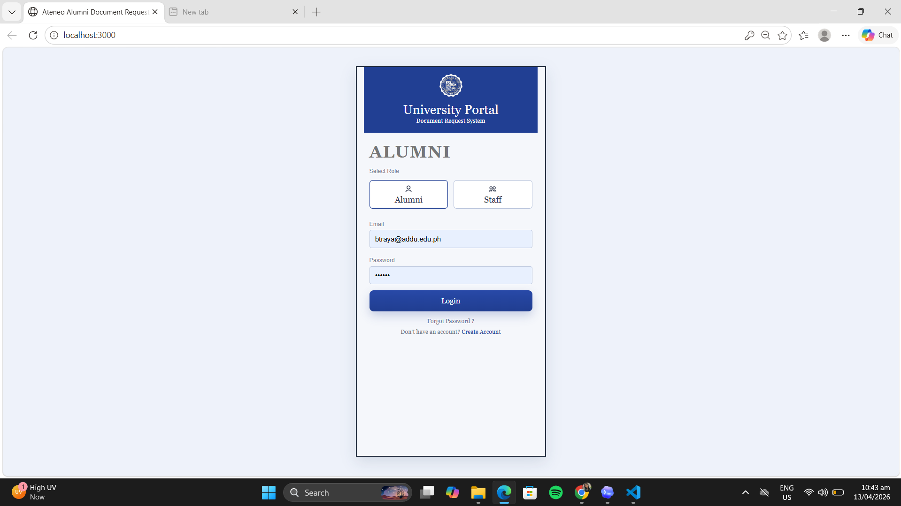
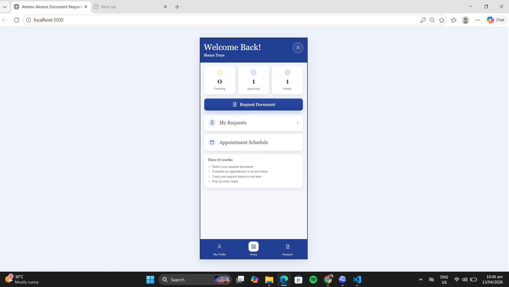

# Traya

---


The Ateneo Alumni Document Request System is a web-based document request platform designed for alumni and staff. It allows users to request university documents, schedule appointments, review request details, and track request progress through a guided interface.

This project was developed using Meteor JS and follows the provided UI screenshots and navigation flow for both Alumni and Staff modules.

## Installation

This repository is built using the Meteor JS framework. To run this project on another computer, make sure the required tools are installed first, then follow the setup steps below.

To open this project you need to install and set up Meteor JS:

1. Install Node.js  
   Download and install Node.js from: https://nodejs.org/

2. Install Meteor JS  
   Follow the official installation guide: https://docs.meteor.com/about/install.html

3. Clone or download this repository  
   If using Git:
   ```bash
   git clone https://github.com/biancatraya28/firstattempt2026_Traya.git

4. Open the project folder
    ```bash
    cd ateneo-alumni-document-request-system

5. Install Project Dependencies
    ```bash
    cd ateneo-alumni-document-request-system

6. Run the application
    ```bash
    meteor run

7. Open the application in your browser

    Visit:
         http://localhost:3000

## AI Tool Used
- ChatGPT
- Codex

## Prompt
[Attached a screenchot of all the screen with and arrow to show the flow]

Build a web app called the Ateneo Alumni Document Request System using Meteor JS. Recreate the provided screenshots and flow exactly as possible. Use Meteor for UI. You can use any CSS so that it can fit the layout of the screenshots. Do not redesign. Do not change the flow, layout, navigation, or buttons. Match the screenshot clearly and exactly as possible.

## Screenshots

### Alumni Login Page


### Alumni Dashboard


### - Alumni Profile


### - Document Request Selection Page


### Appointment Selection Page


### Request Review Page


### Order Tracker Page


### Staff Login Page


### Staff Dashboard


### Status Filter Page


### 


### Admin Profile

